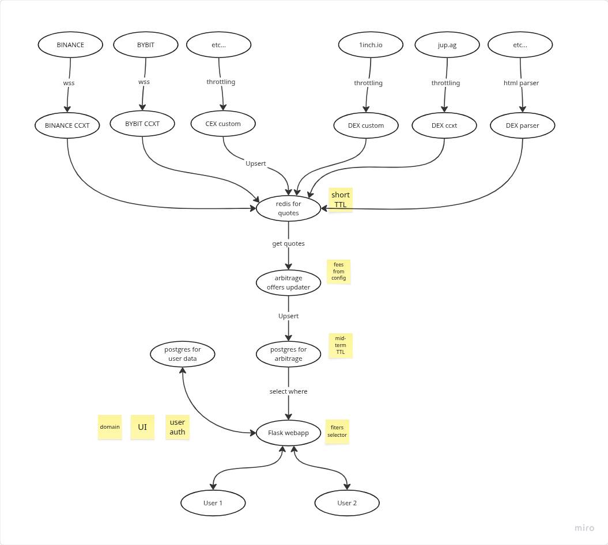

# Бриф
- 8 бирж классических
- данные забираем напрямую с бирж
- проверка сетей на ввод-вывод автоматизированная
- сайт с ЛК
- приём платежей в ручном крипто режиме
- dex пока только исследовать, как мы их парсить можем
- 6 сетей
- сколько монет берём (600 халяльных монет)
- делаем спот+маржу+фьючи
- нужно взять цену маржи с бирж и учитывать это в связках
- что с комиссиями - берём фикс для всех, так проще
- что с бестэксчанджем - скипаем
- 100+ часов
- [референс](https://arbitrage-services.com/#rates)

# Архитектура

# TODO
## Предварительные ресёчи 3h
- проверяем как парсить https://jup.ag 0.5
- проверяем как парсить https://1inch.io 0.5
- фиксируем список CEX + DEX (в зависимости от результатов шагов выше) 0.5 
- проверяем какие биржи поддерживает [CCXT](https://github.com/ccxt/ccxt/wiki/Manual) 0.5
- фиксируем список сетей и монет 1

## Сборщик котировок 14h
- собираем данные с пары CEX так быстро как можем (вебсокет?) через CCXT 3
- добавляем спот 1
- добавляем маржинальные сделки 2
- добавляем фьючи 2
- сохраняем связки с TTL в N секунд (редис?) или, если связки данные приходят инкрементом, удаляем при переподключении 2
- разворачиваем на сервере сборщик котировок 2
- проверяем утечки памяти 2

## Фоновый обновлятор связок 14.5h
- запускается раз в N секунд (нужно проверить скорость работы)
- берём все живые связки из сборщика 0.5
- ищем связки для арбитража 4 
- добавляем фиксированную комиссию 1
- сохраняем связки с TTL в N минут (постгря?) 3
- разворачиваем на сервере сборщик связок 4
- проверяем утечки памяти 2

на этом моменте в теории от 100 часов должно остаться 68 часов

## Проверка сетей на ввод-вывод в сборщике котировок
- найти как эта информация выглядит в API бирж
- не сохранять котировки с отключенных сетей (?)

## Сайт (на русском?) - вот это планирую делегировать частично
- бек на flask
- логин-регистрация (нужна вёрстка)
- статика (НУЖЕН КОНТЕНТ: каналы, мануалы, прочее-прочее)
- приём оплаты ручками и накидывание подписки (решить как)
- фильтры свежих связок (нужна вёрстка)
- добавляем параметры связок для фильтров
- автоэкспирация подписок
- деплоим на сервер (нужен сервер)
- привязываем домен (нужен домен)
- оповещения в браузер (?)
- Время перевода монеты (?)
- Хеджирование (?)

## Добавляем остальные CEX
- собираем данные с оставшихся CEX через CCXT или другие клиенты
- проверяем скорость работы и память

## Добавляем DEX
- собираем данные с выбранных DEX через CCXT или другие клиенты
- проверяем скорость работы и память
