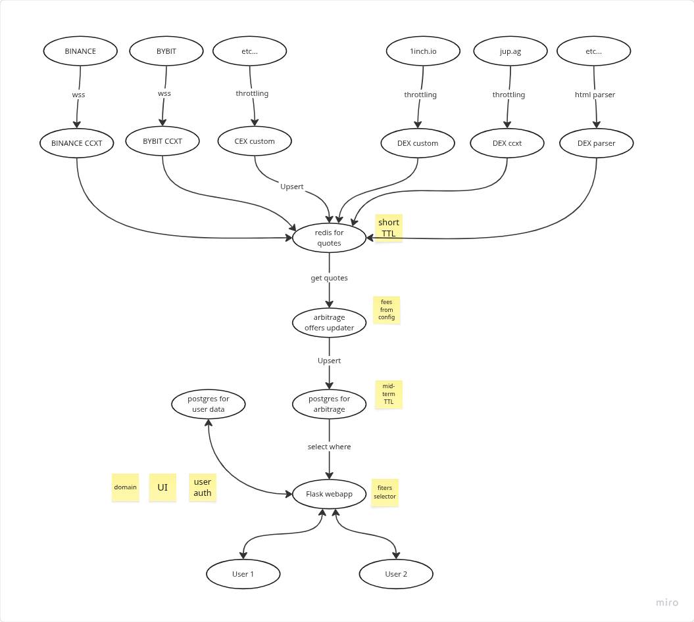

# Бриф
- 8 бирж классических
- данные забираем напрямую с бирж
- проверка сетей на ввод-вывод автоматизированная
- сайт с ЛК
- приём платежей в ручном крипто режиме
- dex пока только исследовать, как мы их парсить можем
- 6 сетей
- сколько монет берём (600 халяльных монет)
- делаем спот+маржу+фьючи
- нужно взять цену маржи с бирж и учитывать это в связках
- что с комиссиями - берём фикс для всех, так проще
- что с бестэксчанджем - скипаем
- 100+ часов
- [референс](https://arbitrage-services.com/#rates)

# Архитектура

# TODO
## Предварительные ресёчи 3h
- [x] проверяем как парсить https://jup.ag 0.5 [price v3 api](https://dev.jup.ag/docs/price-api/v3)
- [x] проверяем как парсить https://1inch.io 0.5 [spot price api](https://portal.1inch.dev/documentation/apis/spot-price/introduction)
- [x] фиксируем список CEX + DEX (в зависимости от результатов шагов выше) 0.5 MEXC и HTX
- [x] проверяем какие биржи поддерживает [CCXT](https://github.com/ccxt/ccxt/wiki/Manual) 0.5

## Сборщик котировок 14h
- [x] собираем данные с MEXC 2
- [x] добавляем спот 1
- [x] собираем данные с HTX 1
- [x] разворачиваем на сервере сборщик котировок 2
- [x] проверяем утечки памяти 2

## Фоновый обновлятор связок 14.5h
- [x] запускается раз в N секунд (нужно проверить скорость работы)
- [x] берём все живые связки из сборщика 0.5
- [x] ищем связки для арбитража 4
- [x] сохраняем связки с TTL в N минут (постгря?) 3
- [x] разворачиваем на сервере сборщик связок 4
- [x] проверяем утечки памяти 2
- [x] добавить поиск связок для шорта 2

## Добавляем фьючи
- [x] добавляем фьючи bitget
- [x] добавляем фьючи bingx
- [x] добавляем фьючи в связки
- [x] добавляем фьючи htx
- [x] добавляем фьючи mexc
- [x] добавляем фьючи в фильтры на сайте

## Добавляем остальные CEX
- [x] bitmart
- [x] lbank
- [x] poloniex
- [x] coinex 
- [x] bybit 
- [x] kucoin 
- [x] gate 
- [x] okx 

## Объём связки
- [x] как рассчитывать объём связки ? 
- [x] фильтруем котировки - оставляем только к USDT + USDС
- [x] фильтруем котировки - берём объём торгов за сутки > 100к

## Фильтр по объёму в моменте 3h
- [x] добавить в котировку данные
- [x] добавить в связку данные
- [x] добавить в фильтры

 
## Проверка сетей на ввод-вывод 14h
- [x] добавить данные о включенных в обе стороны сетях тикера к котировкам 3h
- [x] учесть пересечение по сетям при поиске связок 3h
- [x] добавить сеть как характеристику связки + в уникальный индекс 2h
- [x] выводить сеть на сайте 1h
- [x] Округлять цены до нужного количества знаков при выводе
- [x] нужны апи ключи для 12 бирж, чтобы достать данные по сетям 4h

## Сайт 27h
1. [x] логин через гугл
2. [x] страничка главная - логин/логаут, название
3. [x] страничка прайсов - прайсы
4. [x] страничка связки спот
5. [x] страничка связки фьюч
6. [x] у каждой таблички свои фильтры
7. [x] заливаем с демо-логином на прод
8. [x] выводить курс на биржах
9. [x] осталось дней подписки в шапке при авторизации
10. [x] пейвол для поиска связок
11. [x] показываем новые связки сверху (сортируем по pair.id)
12. [x] добавляем контакт сапорта в футер сайта
13. [x] обновляются результаты фильтрации на лету раз в Н секунд (можно выбрать)
14. [x] ЖДУ ДОМЕН
15. [x] заводим домен на сервак
16. [x] включаем логин через гугл для домена
17. [x] апрувим аккаунт heleket.com (нужен домен)
18. [x] okx УДАЛЯЕМ
21. [x] Базовый фильтр по объёму связки от 100$
19. [x] Шорт связки для спота удаляем
20. [x] Лонг - купить, Шорт - продать, на фьючах оставить как есть
22. [x] делаем оплату через heleket.com

# jup.ag 30h
- [x] меняем иконку платности в топ меню 0.5h
- [x] добавляем страницу подписок для пользователя (показываем активные подписки юзера, предлагаем продлить) 3h
- [x] фикс с размером топ меню на странице цен
- [x] добавляем в связки тип-маркет DEXCEX 1h 
- [x] добавляем страницу связок с dex отдельно от спота и фьючей + в топменю вкладку 4h
- [x] на странице фильтр по объёму, по профиту, выбор бирж
- [x] добавляем генератор связок для dex-CEX отдельно (сравниваем цену на dex с ценой на cex, связки в обе стороны dex->cex + cex->dex) 4h
- [x] пишем отдельный сборщик котировок с юпитера (смотри POC) 8h
- [x] тестируем с какой частотой можем обновлять данные (1RPS max) 1h
- [x] проверяем сколько связок вообще находится (возможно придётся унифицировать имена тикеров) 1h
- [x] удалить сети из вывода для dexcex
- [x] вывести количество монет в связке спот/дексы (объем делить на цену)
- [x] добавить вывод чистой прибыли спот/дексы (объём умножить на спред)
- [x] вывести контракт для dexcex (ссылкой на https://dexscreener.com/search?q=имяконтракта )
- [ ] Ссылки на биржу сразу на тикер/swap
 
- [ ] добавляем отдельные цены для фьючей
- [ ] добавляем отдельные цены для dexcex
Фючерсы месяц 50$  неделя 30$ 
Межбиржа месяц 100$  неделя 50$
Декс месяц 130$ год 700$

Features
---
- [ ] оценить 1inch
- [ ] телеграм бот (нужен бриф)
- [ ] Учитывать пересечение по cexes у котировок с юпитера
- [ ] фильтр по сетям 1h на споте и фьюче
- [ ] lbank прикрутить кастомно ради нового апи - депозит/вывод + вольюм из стакана + бид/аск
- [ ] Перейти на анализ стакана, вместо бид-аск
- [ ] Почистить тикеры: Не брать ёрнинги с htx ?
- [ ] Новый дизайн: Связки по тикеру объединять в табличке
- [ ] Перенести на сервер заказчика
- [ ] Мануалы на сайте 
- [ ] Защита от мультиюза аккаунта
- [ ] Перевод на англ
- [ ] После применения фильтра если открываешь другое окно то заново придётся настроить фильтр
