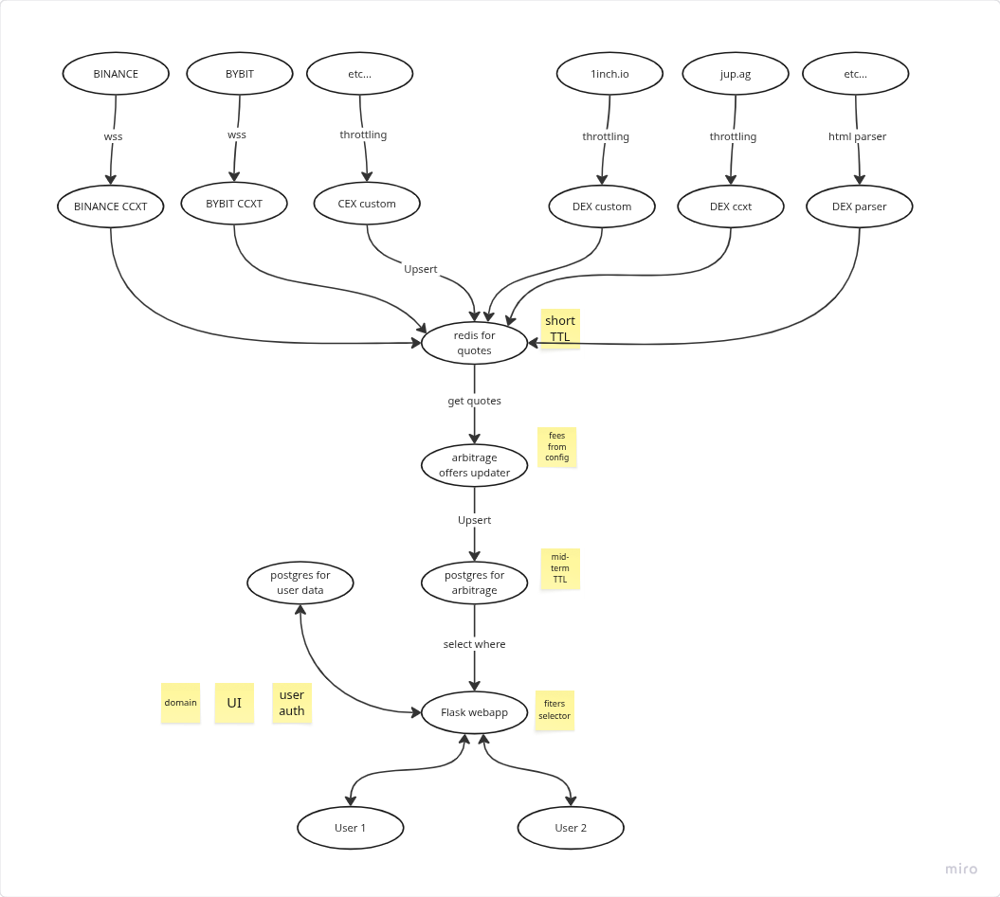

# Бриф
- 8 бирж классических
- данные забираем напрямую с бирж
- проверка сетей на ввод-вывод автоматизированная
- сайт с ЛК
- приём платежей в ручном крипто режиме
- dex пока только исследовать, как мы их парсить можем
- 6 сетей
- сколько монет берём (600 халяльных монет)
- делаем спот+маржу+фьючи
- нужно взять цену маржи с бирж и учитывать это в связках
- что с комиссиями - берём фикс для всех, так проще
- что с бестэксчанджем - скипаем
- 100+ часов
- [референс](https://arbitrage-services.com/#rates)

# Архитектура

# TODO
## Предварительные ресёчи 3h
- [x] проверяем как парсить https://jup.ag 0.5 [price v3 api](https://dev.jup.ag/docs/price-api/v3)
- [x] проверяем как парсить https://1inch.io 0.5 [spot price api](https://portal.1inch.dev/documentation/apis/spot-price/introduction)
- [x] фиксируем список CEX + DEX (в зависимости от результатов шагов выше) 0.5 MEXC и HTX
- [x] проверяем какие биржи поддерживает [CCXT](https://github.com/ccxt/ccxt/wiki/Manual) 0.5

## Сборщик котировок 14h
- [x] собираем данные с MEXC 2
- [x] добавляем спот 1
- [x] собираем данные с HTX 1
- [x] разворачиваем на сервере сборщик котировок 2
- [x] проверяем утечки памяти 2

## Фоновый обновлятор связок 14.5h
- [x] запускается раз в N секунд (нужно проверить скорость работы)
- [x] берём все живые связки из сборщика 0.5
- [x] ищем связки для арбитража 4
- [x] сохраняем связки с TTL в N минут (постгря?) 3
- [x] разворачиваем на сервере сборщик связок 4
- [x] проверяем утечки памяти 2
- [x] добавить поиск связок для шорта 2

## Добавляем фьючи
- [x] добавляем фьючи bitget
- [x] добавляем фьючи bingx
- [x] добавляем фьючи в связки
- [x] добавляем фьючи htx
- [x] добавляем фьючи mexc
- [x] добавляем фьючи в фильтры на сайте

## Добавляем остальные CEX
- [x] bitmart
- [x] lbank
- [x] poloniex
- [x] coinex 
- [x] bybit 
- [x] kucoin 
- [x] gate 
- [x] okx 

## Объём связки
- [x] как рассчитывать объём связки ? 
- [x] фильтруем котировки - оставляем только к USDT + USDС
- [x] фильтруем котировки - берём объём торгов за сутки > 100к

## Фильтр по объёму в моменте 3h
- [x] добавить в котировку данные
- [x] добавить в связку данные
- [x] добавить в фильтры

## Сайт 27h
- [x] логин через гугл
- [x] страничка главная - логин/логаут, название
- [x] страничка прайсов - прайсы
- [x] страничка связки спот
- [x] страничка связки фьюч
- [x] у каждой таблички свои фильтры
- [x] заливаем с демо-логином на прод
- [x] выводить курс на биржах
- [x] осталось дней подписки в шапке при авторизации
- [x] пейвол для поиска связок
- [x] показываем новые связки сверху (сортируем по pair.id)
- [x] добавляем контакт сапорта в футер сайта 
- [x] обновляются результаты фильтрации на лету раз в Н секунд (можно выбрать)
- [ ] заводим домен на сервак
- [ ] включаем логин через гугл для домена
- [ ] апрувим аккаунт heleket.com (нужен домен)
- [ ] делаем оплату через heleket.com

## Проверка сетей на ввод-вывод 14h
- [ ] нужны апи ключи для 12 бирж, чтобы достать данные по сетям 4h
- [ ] добавить данные о включенных в обе стороны сетях тикера к котировкам 3h
- [ ] учесть пересечение по сетям при поиске связок 3h
- [ ] добавить сеть как характеристику связки + в уникальный индекс 2h
- [ ] выводить сеть на сайте 1h
- [ ] фильтр по сетям 1h

## Почистить тикеры: Не брать ёрнинги с htx ?
## Новый дизайн: Связки по тикеру объединять в табличке

Features
---
## Перейти на анализ стакана, вместо бид-аск
## Перевести аккаунт хелекета на заказчика
## Округлять цены до нужного количества знаков при выводе
## Перенести на сервер заказчика
## Ссылки на биржу сразу на тикер
## Бот в ТГ для оповещений 
## Перевод на англ 
## Защита от мультиюза аккаунта
## Мануалы на сайте
## Бот

## Добавляем jup.ag 25h
- апи не даёт выгрузить список живых токенов - придётся либо парсить с сайта, либо спарсить один раз и зашить в конфиг сборщика
- на сайте нашёл только 5 тикеров к USDT и 1 к USDC - оно того стоит вообще?
- в апи используются не человеческие имена тикеров, а внутренние идишки вида `CcVV4V6572y4bp1Ca5z5o8yr2kd36CzNY9HfTMZ3LzdV`
- в апи нет данных по объёму, вводу выводу
- цена, видимо, приводится к USD. Символы скорее вида `PUMP/USDT/USD` vs `PUMP/USDT`
- судя по вводным выше - придётся знатно полюбиться, чтобы это добавить в нашу унифицированную систему учёта. Меньше 20-30 часов я бы точно не брал.

## Добавляем axiom.trade
- тоже самое что jup.ag - апи нет, даже непубличное апи очень скупое
- тикеры вроде как есть, но пойди найди
- больше данные о упоминании тикера в твитере, чем о его финансовых данных
